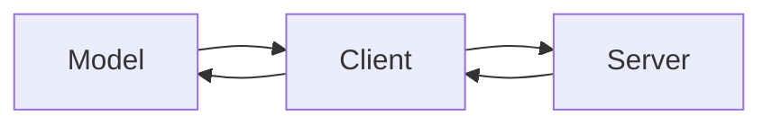
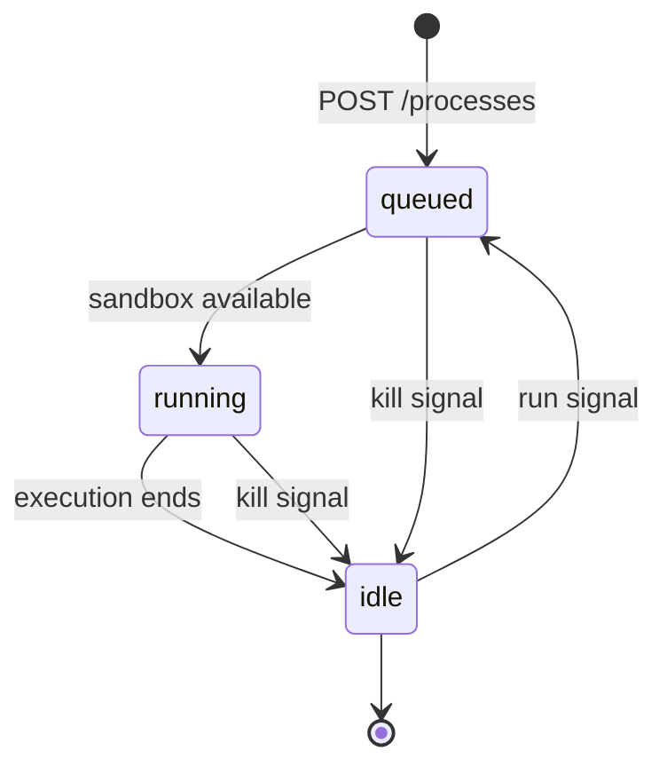

At its core, MCI is simple. The model outputs code expressing an intent. A client detects that intent and submits the code to an MCI server. The server executes it and returns the result. The client feeds that result back to the model.



Each step in this chain is deliberately decoupled. The model does not need to know how its code is executed. The client does not need to know what the code does. The server does not need to know what model produced it.

## The client

The client is the layer that wraps the model. It is responsible for three things: detecting when the model wants to execute code, submitting that code to MCI, and returning the result.

## Processes

A process is a single unit of execution in MCI. When a client submits code, MCI creates a process, queues it, and runs it. Every process has a state and a status.

**State** is where the process is in its life-cycle:

- `queued`: waiting for the sandbox to become available
- `running`: actively executing
- `idle`: execution has ended

**Status** is the outcome of execution, set once the process reaches `idle`:

- `null`: not yet complete
- `success`: completed without error
- `failed`: completed with an error
- `canceled`: terminated early via a kill signal

## Process life-cycle



A process moves linearly from `queued` to `running` to `idle`. From `idle`, a process can be re-queued via the run signal — allowing canceled or completed processes to be executed again.

| State     | Status     | Meaning                                    |
| :-------- | :--------- | :----------------------------------------- |
| `queued`  | `null`     | Waiting for sandbox                        |
| `running` | `null`     | Actively executing                         |
| `idle`    | `success`  | Completed successfully                     |
| `idle`    | `failed`   | Completed with an error                    |
| `idle`    | `canceled` | Prematurely terminated via the kill signal |

## Intent extraction

The client monitors model output and detects when the model is expressing an intent to execute code. How detection works is implementation-defined.

The MCI project recommends wrapping intent in a code block with an `exec` attribute:

````markdown
```ts exec=true
const res = await fetch("https://api.example.com/users/1");
output(res.json());
```
````

When the client sees a code block with `exec=true`, it treats the block body as the code to submit. Any other attributes on the block can be used as metadata by your implementation.

<Note>
  **Detection is implementation-defined**

  You are not required to use code blocks. XML tags, structured JSON, a system prompt convention — any mechanism that reliably extracts the code is valid. What matters is that the right code reaches the MCI server.
</Note>

## Response pipe

Onece the process has been executed, the client would have to send the output back to the model as context. How that is done depends on client implementation.