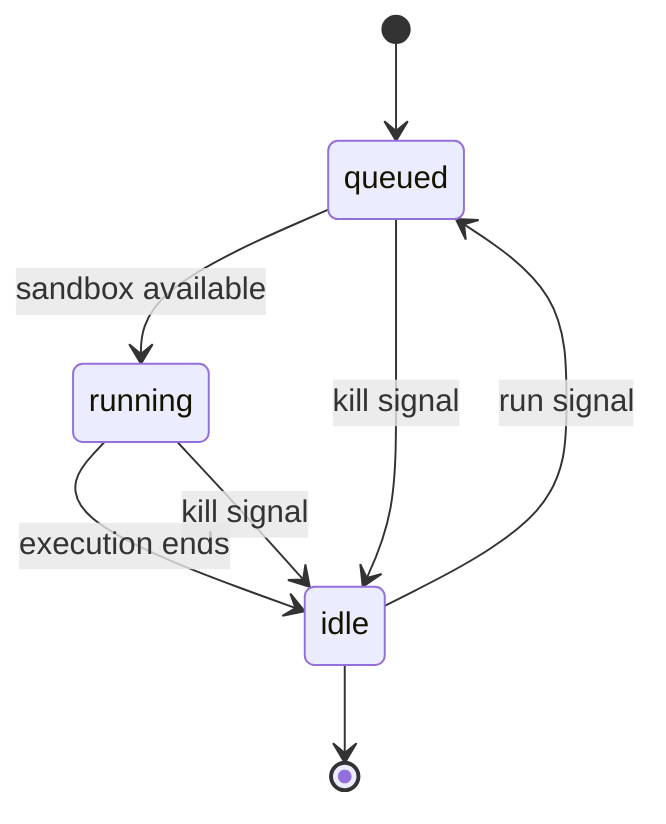

The MCI client wraps a large language model (LLM) and bridges the model's expressed intent to the MCI server. The client detects when the model wants to execute code, submits that code to MCI, and returns the result back to the model.

---

## Intent Extraction

The client monitors model output and detects when the model is expressing an intent to execute code. How detection works is implementation-defined.

The MCI project recommends wrapping intent in a code block with an `exec` attribute.

**Example:**

````markdown
```ts exec=true
const res = await fetch("https://api.example.com/users/1");
output(res.json());
```
````

The client detects the code block with the `exec` attribute and extracts the body as the code to submit.

<Note>
  **Clients may use any other detection mechanism**

  The convention does not affect how requests are submitted to MCI.
</Note>

---

## Process Execution

Once the client has extracted the model's execution intent, it may submit an execution request to the MCI server. Once the code is submitted, the process is queued and run immediately.

The response of the execution request is the `pid` of the created process.

<CodeGroup>

```typescript request
interface CreateProcessRequest {
  code: string
}
```


```typescript response
interface CreateProcessResponse {
  pid: string
}
```

</CodeGroup>

---

## Process Queries

A client connected to an MCI server can query a process or list of processes in the current session in order to track their state and status.

```typescript
interface GetProcessResponse {
  pid: string
  state: "queued" | "running" | "idle"
  status: null | "success" | "failed" | "canceled"
}
```

`state` is the stage of the process lifecycle the process is currently at, and `status` is the execution outcome. `status` is `null` while the process has not yet completed.

---

## Process Outputs

When a process is running or complete, MCI registers a variety of process outputs which the client can query to observe the outcome of execution. These outputs are `output`, `stdout`, and `stderr`.

### Output

This is a custom value set explicitly within the model's intent code. It is distinct from `stdout` —unlike logs or print statements, this output is intentionally structured so that the context fed back to the model is exactly what the intent produced and nothing else.

```typescript
interface GetOutputResponse {
  output: unknown // null | { ... }
}
```

### Stdout

Plain text output captured from the standard output buffer stream of the process execution. Includes print statements, logs, and any other writes to stdout.

### Stderr

Plain text output captured from the standard error buffer stream of the process execution.

---

## Signals

Signals are a way of controlling processes at different stages of their lifecycle.

### Kill

The kill signal stops the execution of a `queued` or `running` process, transitioning it to `idle` with a `canceled` status.

```typescript
interface KillSignalResponse {
  pid: string
  state: "idle"
  status: "canceled"
}
```

### Run

The run signal queues an `idle` process for execution. This is primarily used to re-execute `canceled` processes but can also be used to re-execute completed processes. When re-executing a process that has prior outputs, `force` must be set to `true` to overwrite them.

<CodeGroup>

```typescript request
interface RunSignalRequest {
  force: boolean // force overwrites existing process outputs
}
```


```typescript response
interface RunSignalResponse {
  pid: string
  state: "queued"
  status: null
}
```

</CodeGroup>

---

## Process Life-cycle



A process starts in `queued` the moment it is created and transitions linearly to `running` then `idle`. From `idle`, a process can be re-queued via the run signal, allowing canceled or completed processes to be executed again.

| State     | Status     | Meaning                                    |
| :-------- | :--------- | :----------------------------------------- |
| `queued`  | `null`     | Waiting for sandbox                        |
| `running` | `null`     | Actively executing                         |
| `idle`    | `success`  | Completed successfully                     |
| `idle`    | `failed`   | Completed with an error                    |
| `idle`    | `canceled` | Prematurely terminated via the kill signal |

---

## Response Feedback Pipeline

Once a process has been executed, the client may take the process output and feed it back to the model as context. This step is also implementation-defined. Responses may be polled and queued, or handled synchronously — the approach is left to the implementer.